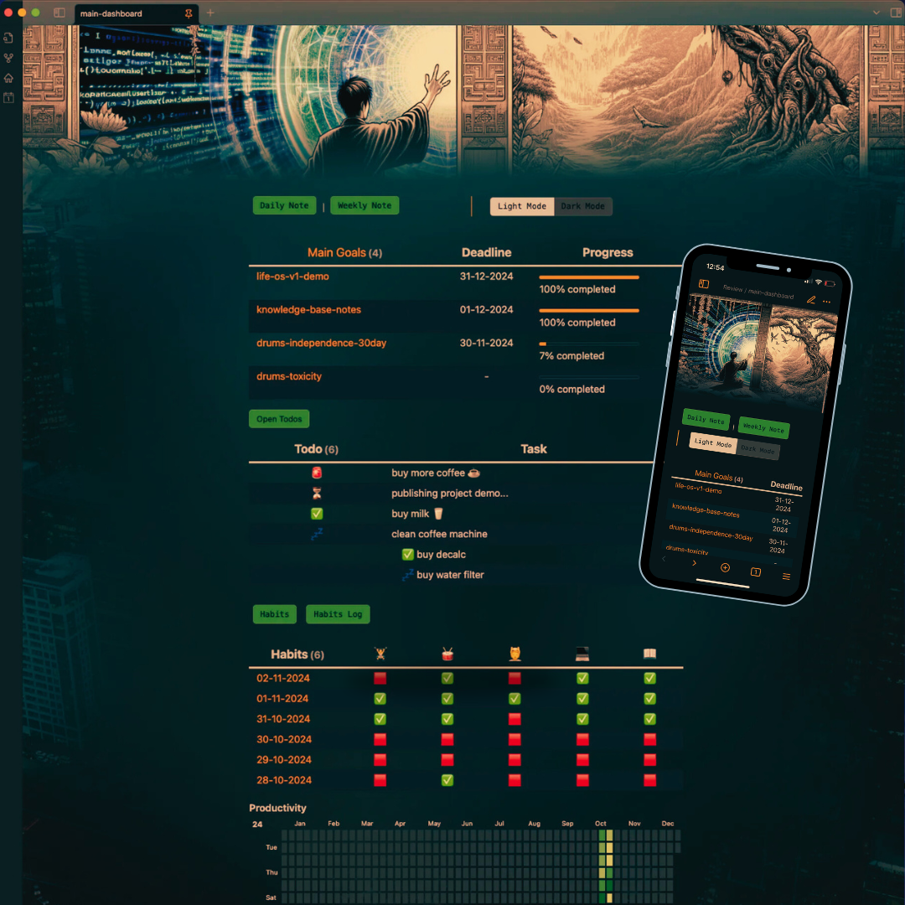

# Obsidian Life Planner Demo Vault

Obsidian Demo Vault presenting automation for daily routines and life goals.

This is the final project of [my article series](https://medium.com/@baquazan/obsidian-life-planner-demo-7466fb8a0f37) published on Medium.
Here are the topics:
- [Setup, main dashboard, banner and theme](https://medium.com/@baquazan/obsidian-life-planner-demo-part-1-f29f5eac3eba) - part 1
- [Goals dashboard](https://medium.com/@baquazan/obsidian-life-planner-demo-part-2-46c56c5dae99) - part 2
- [Todos](https://medium.com/@baquazan/obsidian-life-planner-demo-part-3-90f86b832fdd) - part 3
- [Habits](https://medium.com/@baquazan/obsidian-life-planner-demo-part-4-038d7e4ed329) - part 4
- [Daily / Weekly notes, Productivity](https://medium.com/@baquazan/obsidian-life-planner-demo-part-5-ee147b7567f9) - part 5
- [Back of Sheet, Excalidraw](https://medium.com/@baquazan/obsidian-life-planner-demo-part-6-056b663edea7) - part6
- [Final tweaks, improvements and troubleshooting](https://medium.com/@baquazan/obsidian-life-planner-demo-part-7-7d4cfffe66c9) - part 7

Feel free to open an issue with your ideas, problems, solutions or join the contribution on the next version of this demo! 🦾
I'm always happy to reply swiftly.
